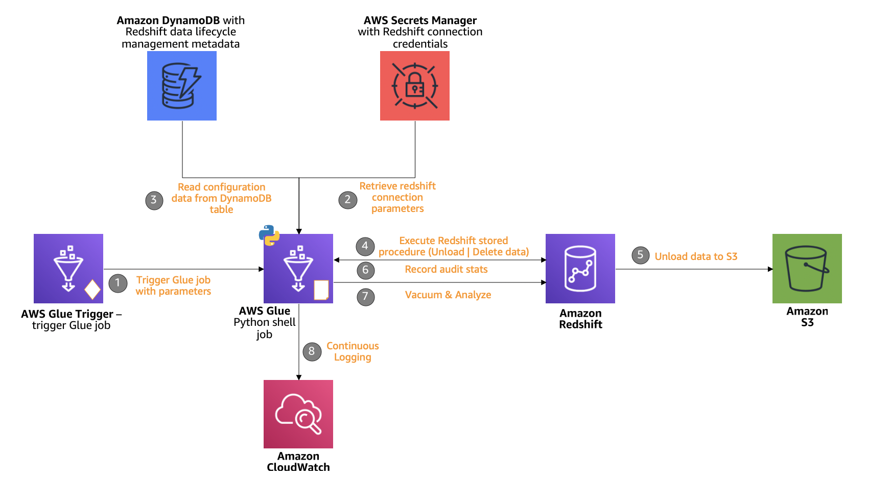
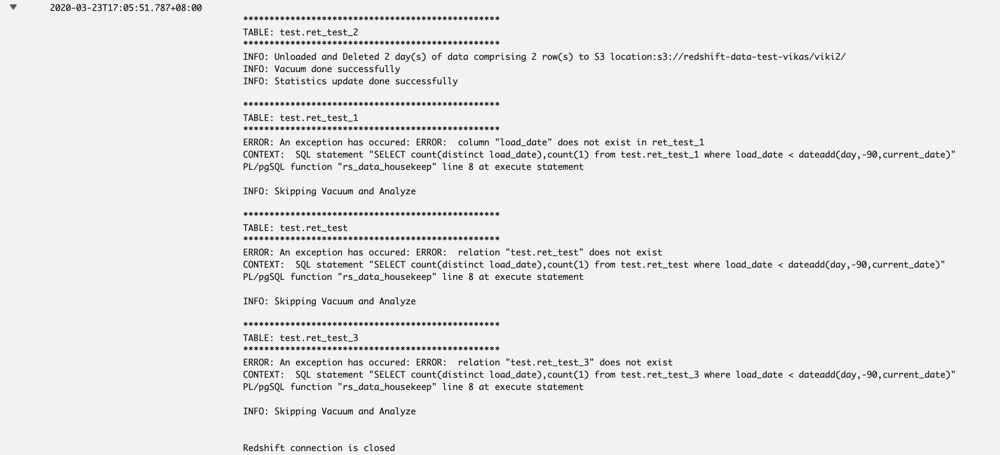
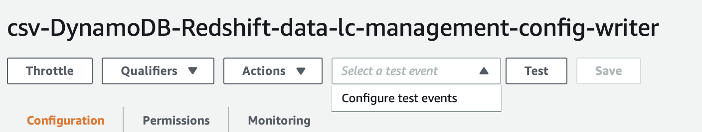
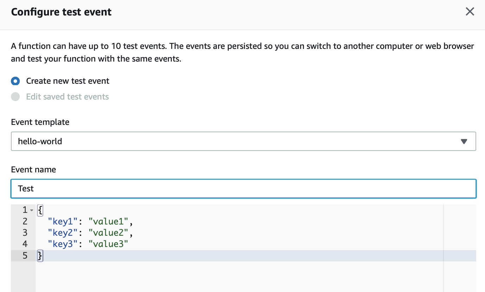
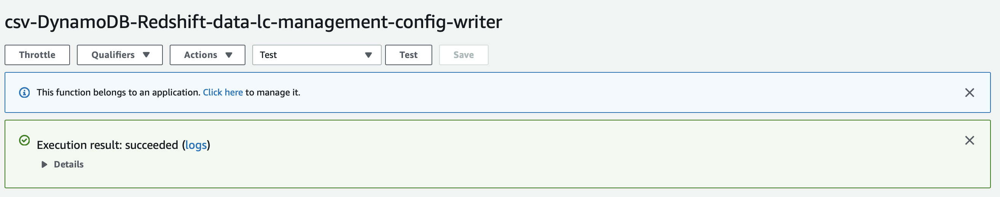
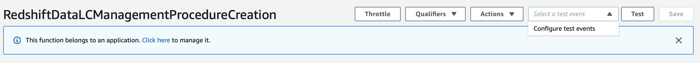
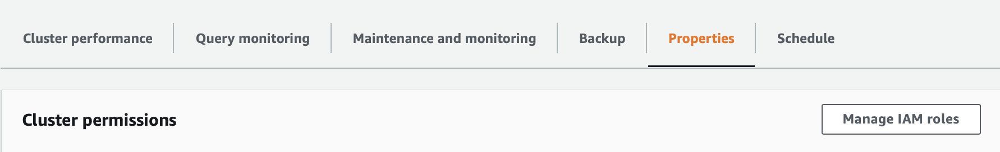
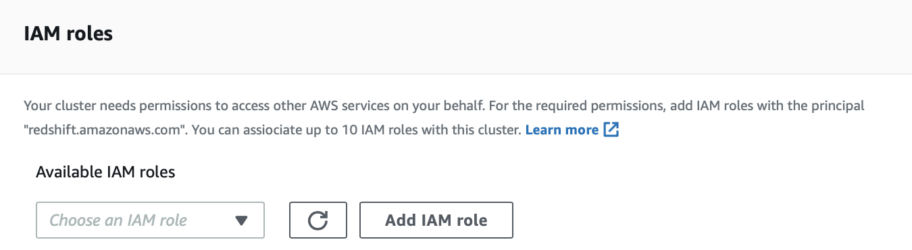

# Amazon Redshift Data Lifecycle Management

This repository contains an implementation example of configuration driven Amazon Redshift data lifecycle management. This example uses Python and PL/pgSQL. 

#### Table of Contents

- [Context](#context)
- [Components](#components)
  - [Amazon Dynamo DB to store the configuration](#amazon-dynamodb)
    - [Parameters from the utility](#parameters-from-the-utility)
    - [Parameters from Amazon Redshift Unload command](#parameters-from-amazon-redshift-unload-command)
  - [Amazon Redshift stored PL/pgSQL procedure](#amazon-redshift-stored-pl/pgsql-procedure)
  - [AWS Glue](#aws-glue)
    - [Python shell job](#python-shell-job)
    - [Database connection](#database-connection)
  - [AWS Secrets Manager](#aws-secrets-manager)
  - [Amazon S3](#amazon-s3)
  - [Amazon CloudWatch](#amazon-cloudwatch)
- [Architectural Patterns & Best Practices](#architectural-patterns-&-best-practices)
- [Deploying the solution with AWS CloudFormation](#deploying-the-solution-with-aws-cloudformation)
  - [Pre-requisites](#pre-requisites)
  - [Steps](#steps)
    - [Load Configuration data](#load-configuration-data)
    - [Create Amazon Redshift PL/pgSQL stored procedure](#create-amazon-redshift-pl/pgsql-stored-procedure)
    - [Add Data Unload IAM Role to Amazon Redshift cluster](#add-data-unload-iam-role-to-amazon-redshift-cluster)
    - [AWS Glue Job](#aws-glue-job)
  - [Clean Up](#clean-up)


## Context

[Amazon **Redshift**](https://aws.amazon.com/redshift/) powers the **lake-house architecture** – enabling you to query data across your data warehouse, data lake, and operational databases to gain faster and deeper insights. With a **lake-house architecture**, you can store data in open file formats in your Amazon S3 data lake. Unloading data from Amazon Redshift cluster to Amazon S3 in open file format may be required due to a variety of reasons. Ex:

- For applications which need data crunched in Amazon Redshift.
- Historical (less frequently accessed/cold) data offloading to Amazon S3. Amazon Redshift **Spectrum** allows standard SQL queries to be submitted against data stored in Amazon S3 via the Amazon Redshift cluster. 
- Teams which need access to data crunched in Amazon Redshift but don't have access to the Redshift cluster.

This implementation example focuses on automating movement (`unload`) and management (`delete`/`vacuum`/`analyze`) of data in Amazon Redshift tables with temporal attributes through a simple configuration while maintaining movement and management choice, priority, logging, auditing and checkpointing. 


## Components

Following building blocks are used to construct the utility:

1. [Amazon **DynamoDB**](https://aws.amazon.com/dynamodb) to store the configuration.
2. Amazon Redshift PL/pgSQL stored procedure.
3. [AWS **Glue**](https://aws.amazon.com/) 
   - Python shell job to move and manage the data based on provided configuration.
   - Database Connection to connect to Amazon Redshift.
4. [AWS **Secrets Manager**](https://aws.amazon.com/secrets-manager/) to securely store Redshift access credentials. 
5. [Amazon **S3**](https://aws.amazon.com/s3/) to store unloaded data. 
6. [Amazon **CloudWatch**](https://aws.amazon.com/cloudwatch/) to log audit and job execution information.





### Amazon DynamoDB

Amazon DynamoDB table is used to store the configuration. Configuration details are described below:

####  Parameters from the utility:

| Paramater Name     | Description                                                  |
| ------------------ | ------------------------------------------------------------ |
| schema_name        | Name of the schema in which the table resides. ***(Amazon DynamoDB primary key)*** |
| table_name         | Name of the table. ***(Amazon DynamoDB sort key)***          |
| column_name        | Name of the column on which retention needs to be applied (date type). |
| granularity_level  | This can be **daily** or **monthly**. 'daily' will look back in days while  'monthly' will look back in months. Ex: For a daily aggregated table, if you  want to retain data for last 90 days, you will use 'daily' as granularity  level and for a monthly table, if you want to retain data for last 6 months,  you will use 'monthly' as granularity level. With 'monthly' granularity level, existing days in the month are skipped in the calculation. Ex: If you execute the job on 20th June 2020 and have data for January 2020, Feburary 2020, March 2020, April 2020, May 2020, June 2020 (partial) with **granularity_level** = `daily`  **retention_period** = `90`, then data before 22nd March 2020 will be under radar of the utility. If you execute the job on 20th  June 2020 and have data for January 2020, Feburary 2020, March 2020, April 2020, May 2020, June 2020 (partial) with **granularity_level** = `monthly`  **retention_period** = `3`, then data for January 2020 and February 2020 will be under radar of the utility. |
| priority           | Integer depicting the order in which tables will lifecycle. Use multiples of 10 to define priorities so that you can sandwich a few tables in the middle of two priorities, if required. Tables with same priorities will be considered in alphabetical order of table names. |
| update_delete_flag | Integer depicting mode of lifecycle. 0 means `unload` only, 1 means `delete`  only and 2 means `unload` and `delete` both. |
| checkpoint         | Date depicting last lifecycle data through the utility (initially left as blank and later managed/updated by utility itself). |
| retention_period   | When granularity_level = `daily`, retention_period is in days, when  granularity_level = `monthly`, retention_period is in months. |

<u>Note</u>: Do not list a table more than once in the configuration. 

#### Parameters from Amazon Redshift Unload command:

Read more details [here]( https://docs.aws.amazon.com/redshift/latest/dg/r_UNLOAD.html). 

| Paramater Name   | Description                                                  |
| ---------------- | ------------------------------------------------------------ |
| s3_path          | s3 path where a particular table need to be unloaded.        |
| file_format      | `PARQUET` or `CSV` or can be left blank.                     |
| partition_column | Name of the column on which unloaded data need to be partitioned on S3. |
| header           | This is a flag which can have either 0 or 1 as values or can be left  blank. `1` = header and `0` or blank = No header. Its not applicable when  file_format is 'parquet'. |
| delimiter        | Specifies a single ASCII character that is used to separate fields in the output file, such as a pipe character \( &#x7c; ), a comma ( , ), or a tab ( \\t ).  Its not applicable when file_format is `PARQUET`. |
| addquotes        | Places quotation marks around each unloaded data field, so that Amazon Redshift can unload data values that contain the delimiter itself. It's only applicable when `file_format` is left  blank i.e. no value is provided. |
| null_as          | Specifies a string that represents a null value in unload files. Its not applicable when file_format is `PARQUET`. |
| escape           | For CHAR and VARCHAR columns in delimited unload files, an escape character is placed before every occurrence of the following characters.  [Linefeed: \n; Carriage return: \r; The delimiter character specified for the  unloaded data; The escape character: \; A quotation mark character: " or  ' (if both ESCAPE and ADDQUOTES are specified in the `UNLOAD` command)]. |
| compression      | This parameter can take one of the following values: `gzip`, `zstd` or `bzip2`. |
| max_filesize     | in `gb` or `mb`. Example: `1 gb`. Chose file sizes depending upon upstream applications and consumption pattern. |
| parallel         | This is a flag which can have either 0 or 1 or can be left empty as values. `1` means PARALLEL ON; `0` means PARALLEL OFF. Default is PARALLEL ON. |
| unload_region    | Specifies the AWS Region where the target Amazon S3 bucket is located. If left blank, will take region value from region parameter value provided to the Glue job which is where your Amazon Redshift cluster exists. |

Sample configuration is provided [here](sample/test_configuration.csv).


### Amazon Redshift stored PL/pgSQL procedure 

PL/pgSQL stored procedure in Amazon Redshift takes in the parameters from the configuration stored in DynamoDB and performs `unload`, `delete` or both, `vacuum` and `analyze` operations.  This stored procedure as output returns the number of rows and number of unload /delete day(s)/month(s) of data and the last checkpoint per line item in the configuration.


### AWS Glue 

#### Python shell job

AWS Glue Python shell job reads the configuration from Amazon DynamoDB table and parses each line item from the configuration by priority to Amazon Redshift stored procedure. This job accepts following variables during runtime:

- **region_name**: Name of the region of Amazon DynamoDB table.
- **dynamodb_table_name**: Name of Amazon DynamoDB table with the configuration.
- **secret**: Name or arn of the secret with Amazon Redshift access credentials.
- **role_arn**: Amazon Redshift role arn with permission to unload data to Amazon S3.
- **redshift_schema**: Amazon Redshift schema where the [stored procedure](src/Redshift_Data_LifecycleManagement_SP.sql) is created.

This job will

- Read the configuration data from DynamoDB.
- Prioritize each line item from the configuration based on value in `priority` column.
- Parse the values to construct values to be passed to Amazon Redshift stored procedure. 
- Performs unload or delete or both operations based on `update_delete_flag` in the configuration. Unload operation is performed based on parameters provided in the configuration.
- Performs `vacuum` and `analyze` operation.
- Logs number of day(s)/month(s) and number of rows unloaded or deleted or both in Amazon CloudWatch logs.
- Update the checkpoint in DynamoDB table. 

The process is repeated for all the line items in the configuration. 


#### Database connection

A connection to Amazon Redshift is referenced or created under AWS Glue Database connection to connect to Amazon Redshift cluster during the job execution.


### AWS Secrets Manager

AWS Secrets Manager holds the Amazon Redshift access credentials for AWS Glue Python shell job to securely access Amazon Redshift. This secret is also used by a Lambda function deployed by AWS CloudFormation to create PL/pgSQL stored procedure in Amazon Redshift. 


### Amazon S3

Amazon S3 is used for the following purpose:

- Unload data from Amazon Redshift to Amazon S3 as defined in the configuration file per line item.
- Place configuration file to load into Amazon DynamoDB table.


### Amazon CloudWatch

Amazon CloudWatch captures all logs related to the job execution. Job execution logs can be found in "**Log Groups**" >> "**/aws-glue/python-jobs/output**" job error logs can be found in "**Log Groups**" >> "**/aws-glue/python-jobs/error**" under corresponding job run id. Errors corresponding to configuration are captured under job output (example: Defining a table in the configuration which does not exist). Snippet of a successful execution of a job execution is shown below:




## Architectural Patterns & Best Practices

Data environment and pipelines involving a Data Warehouse differ from implementation to implementation and hence it is important to understand how this implementation example can be adopted to best suit your existing setup. There are a few key things to keep in mind while referencing this implementation example:

- **Configuration store**: This reference implementation stores Amazon Redshift data lifecycle management configuration data in a DynamoDB table. However, if in your current environment, you are using a metadata store other than Amazon DynamoDB (like RDS-mySQL) then adapt the solution to use your existing metadata store to store the configuration. You can still use Amazon DynamoDB to host this particular configuration but it is recommended to store all configuration data in one single place.
- **Python job execution**: This reference implementation makes use of AWS Glue Python shell to execute a python job to manage Amazon Redshift data lifecycle based on configuration stored in Amazon DynamoDB table. However, if you are already using something to run python jobs in your environment, say Apache Airflow, and do not want to use AWS Glue, you can use the code provided in this reference implementation and adapt it to make it work with your existing tool. 
- **Job Cloning:** It is recommended to split configuration into multiple tables in case there are several tables to manage or should be handled separately due to business reasons. Create clones of python job and have them read the configuration from either multiple tables or adapt the code to read data from one single table based on required segregation logic. Example: Cloning jobs based on schema in Amazon Redshift cluster or completing data lifecycle management on an Amazon Redshift cluster having 100 tables to lifecycle on a daily basis during a fixed time window.
- **Addition of Parameters**: There are multiple parameters provided with this reference implementation. However, there may be scenarios where you want to additional parameters in the configuration to suit your requirements. 


## Deploying the solution with AWS CloudFormation

This reference architecture provides a JSON template for referencing and deploying resources required to implement the solution with [AWS CloudFormation](https://aws.amazon.com/cloudformation/).

### Pre-requisites

- An AWS Account
- The **AdministratorAccess** policy granted to your AWS account
- An existing Amazon Redshift Cluster

Refer to instructions in [DEVELOPMENT.md](./DEVELOPMENT.md) file to get AWS CloudFormation deployment.

Amazon CloudFormation deploys:

Two Lambda functions:

- **csv-DynamoDB-Redshift-data-lc-management-config-writer** to create an Amazon DynamoDB table, if not exists and load configuration data into it. Sample configuration data is provided [here](sample/test_configuration.csv).

- **RedshiftDataLCManagementProcedureCreation** to create PL/pgSQL stored procedure in Amazon Redshift.

A Glue Management job:

- **op_redshift_data_lc_management** (default Glue job name) to read configuration from DynamoDB and apply it on configured Redshift tables. 

CloudFormation template will also create a few other required components depending upon the provided inputs.


### Deployment Steps

#### Load Configuration data

Follow the below steps to create an Amazon DynamoDB table, if not exists and load configuration data into it.

- Select AWS **Lambda** from the **Services** in the AWS Console.

- Select **Functions** from left side menu.

- Click on **csv-DynamoDB-Redshift-data-lc-management-config-writer** function.

- Configure a Test event by clicking **Configure test events**.

  

  


- Enter **Event name** as **Test**.

  

  


- Scroll a bit down and hit **Create**.

- Hit **Test**. Execution result should return **succeeded** implying Amazon DynamoDB table, if not exists has been created and  configuration data has successfully been loaded into it.

  ​	


#### Create Amazon Redshift PL/pgSQL stored procedure

Follow the below steps to create the PL/pgSQL stored procedure in Amazon Redshift.

- Select AWS **Lambda** from the **Services** in the AWS Console.

- Select **Functions** from left side menu.

- Click on **RedshiftDataLCManagementProcedureCreation** function.

- Configure a Test event by clicking **Configure test events**.

  ​	

  


- Enter **Event name** as **Test**.

  

  


- Scroll a bit down and hit **Create**.
- Hit **Test**. Execution result should return **succeeded** implying PL/pgSQL stored procedure in Amazon Redshift has been created successfully.


#### Add Data Unload IAM Role to Amazon Redshift cluster

Amazon CloudFormation template has created an IAM role to enable data unload from Amazon Redshift to Amazon S3. Follow the steps below to add the role to Amazon Redshift cluster.

- Select Amazon **Redshift** from the **Services** in the AWS Console.

- Select **CLUSTERS** from left side menu.

- Select the cluster for which you are managing the lifecycle and provided credentials to the AWS CloudFormation stack.

- Select **Manage IAM roles** under **Properties**. 

  

  


- Select IAM role **RedshiftUnload-*<region_name>*-*<stack_name>*-Role** from the drop down under **Available IAM roles** and hit **Add IAM role**.

  

  


- Amazon Redshift cluster will go into **Modifying** state for a few seconds. Wait until the cluster comes back to **Available** state.
- IAM role for unloading data has been successfully added to the cluster.


#### AWS Glue Job

An AWS Glue python shell job has been deployed with the AWS CloudFormation stack with the name (default is **op_redshift_data_lc_management**) provided during the creation of the stack. After doing above steps, you should have all components ready to schedule the AWS Glue python shell job to automate movement and management of data in Amazon Redshift. The job can scheduled using AWS Glue trigger.


### Clean Up

To clean up, follow the below steps:

- Delete the Amazon CloudFormation stack.

- Drop the Amazon Redshift procedure manually. Replace schema name with the schema which was entered during deploying AWS CloudFormation stack. 

  ```sql
  drop procedure <schema name>.rs_data_lc_manager(schema_name IN varchar(32), table_name IN varchar(32), col_name IN varchar(32), gran_level IN varchar(8), ret_period IN int, s3_path IN varchar(256), file_format IN varchar(128),partition_column IN varchar(32), role_name IN varchar(256), region_name IN varchar(256), max_filesize IN varchar(16), parallel_flag IN varchar(16), update_delete_flag IN int, checkpoint IN varchar(32), days_out_count OUT int, rows_out_count OUT int, checkpoint_out_date OUT varchar(32));
  ```

- Drop the Amazon DynamoDB table manually which was created by AWS CloudFormation stack.


## Security

See [CONTRIBUTING](CONTRIBUTING.md#security-issue-notifications) for more information.

## License

This library is licensed under the MIT-0 License. See the LICENSE file.

